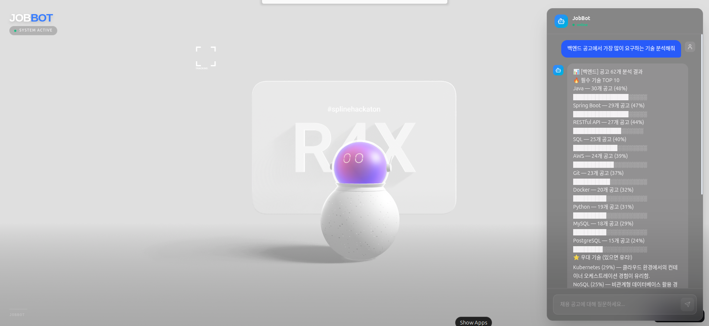

# JobBot — 채용 공고 RAG 챗봇

> 원티드 실제 채용 공고 500개를 기반으로 기술 트렌드를 분석하고 질문에 답하는 AI 챗봇

<p align="center">
  
</p>

---

## 주요 기능

- **채용 트렌드 분석** — "백엔드 공고에서 가장 많이 요구하는 기술은?" → TOP 10 + 진행막대 통계
- **직군/경력 필터링** — 프론트엔드, 주니어, 시니어 등 조건별 분석
- **기술 개념 설명** — "Docker가 뭐야?" → 채용 시장 데이터 기반 설명
- **멀티턴 대화** — "그럼 프론트엔드는?" 같은 후속 질문 맥락 유지
- **스트리밍 응답** — SSE로 타이핑 효과 실시간 출력

---

## 기술 스택

| 분류 | 기술 |
|------|------|
| API 서버 | FastAPI, Uvicorn |
| RAG 파이프라인 | LangChain LCEL |
| 벡터 저장소 | ChromaDB + OpenAI `text-embedding-3-small` |
| 검색 | Hybrid Search (Vector + BM25) + RRF + Reranker |
| LLM | GPT-4o-mini |
| 프론트엔드 | React + TypeScript + Vite + Spline 3D |
| 스트리밍 | SSE (Server-Sent Events) |
| 테스트/CI | pytest + GitHub Actions |

---

## RAG 아키텍처

```
사용자 질문
    │
    ├─ 분석 질문? (백엔드 기술 분석해줘)
    │       └─ Full Scan — raw JSON 직독 + 직군/경력 필터링 → LLM
    │
    └─ 설명 질문? (Docker가 뭐야?)
            └─ Hybrid Retrieval
                    ├─ Vector Search (ChromaDB)
                    └─ BM25 Keyword Search
                            └─ RRF 점수 합산 → Reranker → LLM
```

**Full Scan을 쓰는 이유**: 벡터 검색은 일부 문서만 가져와서 "62개 중 30개" 같은 정확한 통계를 낼 수 없음. 분석 질문은 전체 데이터를 직접 읽어 LLM에 전달하는 방식으로 설계.

---

## 기술적 의사결정

| 결정 | 선택 | 선택 이유 |
|------|------|-----------|
| 검색 방식 | Hybrid (Vector + BM25) | 키워드 매칭(BM25)이 기술 스택 검색에서 의미 검색을 보완 |
| 점수 결합 | RRF | 서로 다른 스케일의 점수를 순위 기반으로 안정적으로 결합 |
| 청킹 전략 | Semantic (섹션 기반) | 채용 공고 구조(자격요건/우대사항/주요업무)를 활용한 의미 있는 분할 |
| 분석 라우팅 | Full Scan | 정확한 통계를 위해 벡터 검색 대신 전체 데이터 직독 |
| 벡터 DB | ChromaDB | 로컬 실행, 무료, 메타데이터 필터링 지원 |

---

## 평가 결과

15개 질문 기반 end-to-end 답변 품질 평가 (`evaluation/eval_dataset.json`)

| 지표 | 결과 | 설명 |
|------|------|------|
| 키워드 포함률 | **76.7%** | 예상 키워드가 답변에 포함된 비율 |
| LLM Judge 평균 | **3.67 / 5.0** | GPT-4o-mini가 채점한 답변 품질 |

---

## 실행 방법

```bash
# 1. 의존성 설치
pip install -r requirements.txt

# 2. 환경 변수 설정
cp .env.example .env
# OPENAI_API_KEY 입력

# 3. 데이터 인제스트
python -m app.ingestion.ingest

# 4. 백엔드 실행
uvicorn app.main:app --reload

# 5. 프론트엔드 실행 (별도 터미널)
cd frontend && npm install && npm run dev
```

### 테스트

```bash
pytest tests/ -v  # 61개 단위 테스트
```

### RAG 평가

```bash
python -m evaluation.evaluate --no-llm-judge  # 키워드 포함률만
python -m evaluation.evaluate                  # LLM Judge 포함
```

---

## 프로젝트 구조

```
job-rag-chatbot/
├── app/
│   ├── api/            # FastAPI 라우터, Pydantic 스키마
│   ├── core/           # 설정, 임베딩, 벡터스토어
│   ├── ingestion/      # 원티드 크롤러, 로더, 청커
│   └── rag/            # RAG 체인, 하이브리드 검색기, 리랭커
├── evaluation/         # RAG 평가 시스템 (키워드 포함률, LLM Judge)
├── frontend/           # React + Spline 3D UI
├── tests/              # 단위 테스트 61개 (loader, chunker, chain)
├── data/               # 원티드 채용 공고 데이터 500개
└── .github/workflows/  # GitHub Actions CI
```
