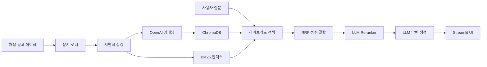

# 💼 채용 공고 RAG 챗봇

> 채용 공고 데이터를 기반으로 질문에 답변하는 RAG(Retrieval-Augmented Generation) 챗봇

## 프로젝트 소개

취업 준비 중 수많은 채용 공고를 일일이 비교하고 분석하는 것은 시간이 많이 소요됩니다. 이 프로젝트는 채용 공고 데이터를 벡터 DB에 저장하고, 하이브리드 검색과 LLM을 결합하여 자연어 질문에 정확한 답변을 제공하는 RAG 시스템입니다.

**주요 기능:**
- 채용 공고 데이터 자동 수집 및 벡터화
- 하이브리드 검색 (Vector + BM25) 기반 정확한 문서 검색
- LLM Reranker를 통한 검색 결과 품질 향상
- Streamlit 기반 대화형 채팅 UI

## 데모

<!-- 스크린샷 추가 예정 -->
<p align="center">
  
</p>

**사용 예시:**
```
사용자: Python 백엔드 개발자 채용 공고 알려줘
챗봇: 현재 검색된 공고 중 Python 백엔드 개발자 관련 공고입니다:
      1. 메디컬AI - 백엔드 개발자 (Django) / 경력 3~6년
      2. 핀테크랩스 - 서버 개발자 (Python/FastAPI) / 경력 2~5년
      ...
```

## 아키텍처



**데이터 흐름:**
1. **수집**: 채용 공고 JSON 로드
2. **청킹**: 시맨틱 전략으로 섹션별 분할 (주요업무, 자격요건, 우대사항 등)
3. **임베딩**: OpenAI `text-embedding-3-small`로 벡터화
4. **저장**: ChromaDB에 영속 저장
5. **검색**: Vector + BM25 하이브리드 검색 → RRF 점수 결합
6. **재정렬**: LLM Reranker로 관련성 재평가
7. **생성**: GPT-4o-mini로 답변 생성

## 기술적 의사결정

| 결정 사항 | 선택 | 대안 | 선택 이유 |
|-----------|------|------|-----------|
| 벡터 DB | ChromaDB | Pinecone, Weaviate | 로컬 실행 가능, 설정 간편, 무료 |
| 청킹 전략 | Semantic (섹션 기반) | Recursive, Fixed | 채용 공고 구조(주요업무/자격요건/우대사항)를 활용한 의미 있는 분할 |
| 검색 방식 | Hybrid (Vector + BM25) | Vector-only | 키워드 매칭(BM25)이 기술 스택 검색에서 의미 검색을 보완 |
| 점수 결합 | RRF (Reciprocal Rank Fusion) | 단순 병합 | 서로 다른 스케일의 점수를 순위 기반으로 안정적으로 결합 |
| Reranker | LLM-based (GPT-4o-mini) | Cross-Encoder | 별도 모델 없이 LLM으로 관련성 평가, 배포 간편 |
| LLM | GPT-4o-mini (API) / Ollama (Local) | GPT-4o | 비용 효율적이면서 한국어 성능 우수, 로컬 모드로 무료 전환 가능 |
| 임베딩 | text-embedding-3-small | text-embedding-3-large | 비용 대비 성능 충분, 채용 공고 도메인에서 large 대비 차이 미미 |

## 실험 결과

### 청킹 전략 비교

| 전략 | chunk_size | 청크 수 | 평균 길이 | 특징 |
|------|-----------|---------|----------|------|
| recursive | 500 | 60 | 295자 | 범용적이나 섹션 경계 무시 |
| **semantic** | 500 | 300 | 55자 | 섹션별 분할, 메타데이터 풍부 |
| fixed | 500 | 60 | 296자 | 베이스라인 |

### 검색 성능

<!-- 평가 실행 후 결과로 업데이트 예정 -->

| 지표 | 값 |
|------|-----|
| Precision@5 | - |
| Recall@5 | - |
| MRR | - |
| 키워드 포함률 | - |
| LLM Judge 평균 | - |

## 개선 과정

| 버전 | 구현 내용 | 개선점 |
|------|----------|--------|
| v1 | 기본 벡터 검색 + LLM | 키워드 검색 누락 (예: "FastAPI" 정확 매칭 실패) |
| v2 | + BM25 하이브리드 검색 | 키워드 매칭 개선, RRF로 점수 결합 |
| v3 | + 시맨틱 청킹 | 섹션별 분할로 검색 정밀도 향상 |
| v4 | + LLM Reranker | 관련성 높은 문서 우선 배치 |

## 실행 방법

### Docker (권장)

```bash
# 1. 환경 변수 설정
cp .env.example .env
# .env 파일에 OPENAI_API_KEY 입력

# 2. 실행
docker-compose up --build

# API: http://localhost:8000/docs
# UI:  http://localhost:8501
```

### 로컬 개발

```bash
# 1. 환경 설정
conda create -n job-rag-chatbot python=3.12 -y
conda activate job-rag-chatbot
pip install -r requirements.txt

# 2. 환경 변수
cp .env.example .env
# .env 파일에 OPENAI_API_KEY 입력

# 3. 데이터 인제스트
python -m app.ingestion.ingest

# 4. 서버 실행
python -m app.main

# 5. UI 실행 (별도 터미널)
streamlit run frontend/streamlit_app.py
```

## 기술 스택


## 프로젝트 구조

```
job-rag-chatbot/
├── app/
│   ├── main.py              # FastAPI 서버 (lifespan으로 RAG 초기화)
│   ├── api/
│   │   ├── routes.py        # API 엔드포인트 (query, health, ingest, stats)
│   │   └── schemas.py       # Pydantic v2 스키마
│   ├── core/
│   │   ├── config.py        # pydantic-settings 기반 환경 변수
│   │   └── embeddings.py    # VectorStore 클래스 (ChromaDB 관리)
│   ├── rag/
│   │   ├── chunker.py       # 3가지 청킹 전략 (recursive/semantic/fixed)
│   │   ├── retriever.py     # HybridRetriever (Vector + BM25 + RRF)
│   │   ├── reranker.py      # LLM 기반 Reranker
│   │   └── chain.py         # RAGChain (LCEL 기반)
│   └── ingestion/
│       ├── crawler.py       # 샘플 데이터 생성 (30개 채용 공고)
│       ├── loader.py        # JSON → LangChain Document 변환
│       └── ingest.py        # 인제스트 파이프라인 (CLI)
├── frontend/
│   └── streamlit_app.py     # 채팅 UI
├── evaluation/
│   ├── eval_dataset.json    # 25개 평가 질문 세트
│   └── evaluate.py          # RAGEvaluator (Precision, Recall, MRR, LLM Judge)
├── experiments/
│   └── chunking_comparison.py
├── docker-compose.yml
├── Dockerfile
└── requirements.txt
```

## 향후 계획

- [ ] 임베딩 모델 파인튜닝 (한국어 채용 공고 도메인)
- [ ] 멀티턴 대화 지원 (대화 히스토리 컨텍스트)
- [ ] 실시간 채용 공고 크롤링 연동 (원티드, 사람인 등)
- [ ] Hugging Face 로컬 임베딩 지원 (API 비용 제거)
- [ ] 메타데이터 필터링 (지역, 경력, 기술스택 기반)
